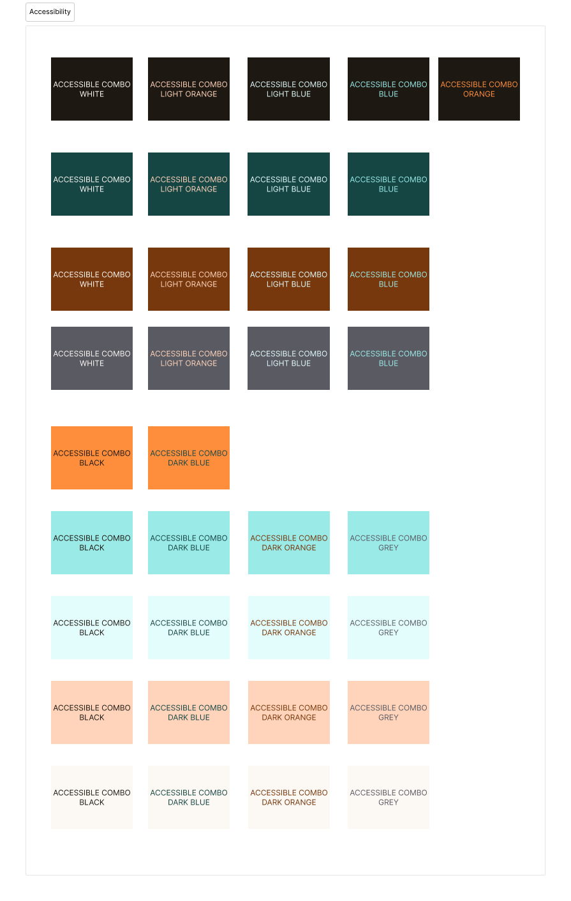

# Accessibilité de l'application

## Introduction

L'accessibilité de l'application est un aspect important qui doit être pris en compte lors de son développement. Il est important de garantir que l'application soit accessible à tous les utilisateurs, y compris ceux ayant des handicaps ou des limitations cognitives.

## Guide de référence

Nous suivons le référenciel imposé par le gouvernement français : [RGAA - Référentiel général d'amélioration de l'accessibilité](https://accessibilite.numerique.gouv.fr/).

## Tests d'accessibilité

Nous utilisons les outils suivants pour tester l'accessibilité de l'application :

- [Lighthouse](https://github.com/GoogleChrome/lighthouse) : Outil de test d'accessibilité paramétré sur l'intégration continue du projet (voir [CI/CD](../CICD.md)).
- [Axe](https://github.com/dequelabs/axe-core) : Extension à installer sur son navigateur.
- [Tanaguru](https://github.com/tanaguru/tanaguru) : Extension à installer sur son navigateur.
- [Wave](https://wave.webaim.org/) : Extension à installer sur son navigateur.

## Bonnes pratiques

À chaque commit, il faut penser à vérifier que l'accessibilité de l'application n'est pas compromise. Pour cela, pensez à utiliser les outils précédement mentionnés sur chaque écran impliqué par les changements développés.

Pour rappel des éléments principaux à vérifier : 
- Les images doivent avoir un attribut `alt` vide si elles ne portent pas une information pertinente, et inversement, les images porteuses d'informations doivent avoir un attribut `alt` décrivant l'information portée.
- Les liens doivent avoir un texte explicite.
- Les boutons qui servent de lien doivent avoir l'attribut `asChild` et l'élément `Link` comme enfant.
- Les champs de formulaire doivent toujours avoir un label associé, visible ou non. Penser à utiliser l'attribut `htmlFor` pour associer le label au champ.
- Les niveaux de titres doivent être utilisés de manière cohérente. Utilisez l'outil **HeadingsMap** de Lighthouse pour vérifier que les niveaux de titres sont utilisés de manière cohérente.
- Tout élément ressemblant à une liste DOIT être une liste, avec les éléments `<ul>` ou `<ol>`, et les éléments enfants `<li>`.
- Une information ne peut être portée seulement par la couleur. Il faut aussi un élément visuel pour la représenter.
- Les couleurs utilisées doivent être validées par le tableau ci-dessous : 

