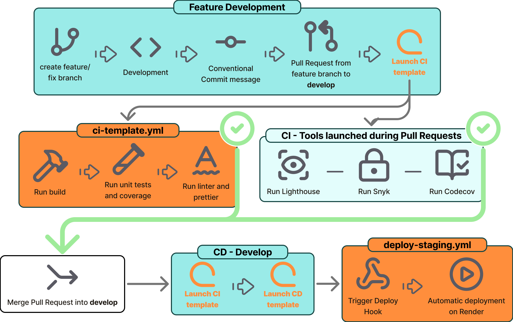
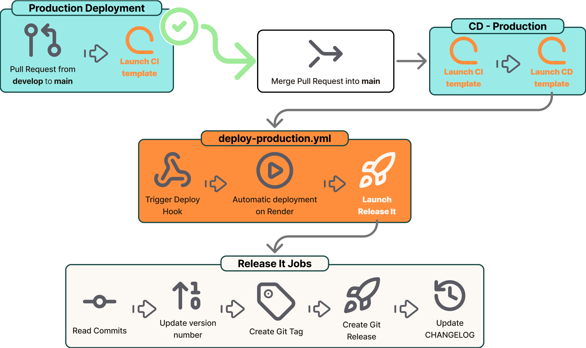

# CI/CD Documentation

## Vue d'ensemble

Ce projet utilise **GitHub Actions** pour automatiser l'intégration continue (CI) et le déploiement continu (CD). Le processus garantit la qualité du code et automatise les déploiements vers les environnements de staging et de production.

## Architecture des environnements

- **Branche `develop`** → Déploiement automatique vers **Staging**
- **Branche `main`** → Déploiement automatique vers **Production**

## Workflows détaillés

### 1. CI - Validation des Pull Requests

**Fichier** : [`pull-requests-ci.yml`](../.github/workflows/pull-requests-ci.yml)

**Déclencheur** : Création ou modification d'une PR sur `main` ou `develop`

**Actions réalisées** :

- Exécution du CI template (voir [CI Template](#ci-template))
- Exécution du Lighthouse template (voir [Lighthouse Template](#lighthouse-template))

### 2. CD - Déploiement Staging

**Fichier** : [`deploy-staging.yml`](../.github/workflows/deploy-staging.yml)

**Déclencheur** : Push sur la branche `develop`

**Processus** :

1. Exécution du CI Template (voir [CI Template](#ci-template))
2. Build de l'application
3. Déploiement sur l'environnement de staging via hook Render

### 3. CD - Déploiement Production

**Fichier** : [`deploy-prod.yml`](../.github/workflows/deploy-prod.yml)

**Déclencheur** : Push sur la branche `main`

**Processus** :

1. Exécution du CI Template (voir [Templates réutilisables](#templates-réutilisables))
2. Build de l'application
3. Déploiement sur l'environnement de production via hook Render
4. Génération automatique d'une release GitHub (voir [Workflow Release](#workflow-release))

## Templates réutilisables

### CI Template

**Fichier** : [`ci-template.yml`](../.github/workflows/ci-template.yml)

Template réutilisable qui automatise :

- Installation des dépendances
- Exécution des tests unitaires
- Vérification du linting
- Build de l'application

### Lighthouse Template

**Fichier** : [`lighthouse-template.yml`](../.github/workflows/lighthouse-template.yml)

Template réutilisable pour les tests de performance :

- Tests de performance
- Tests d'accessibilité
- Tests SEO
- Génération de rapports Lighthouse

## Workflow Release

**Fichier** : [`release.yml`](../.github/workflows/release.yml)

Automatise la gestion des versions :

- Génération des notes de release
- Création de tags Git
- Mise à jour du changelog
- Publication de la release sur GitHub

## Configuration

### Secrets requis

Les workflows utilisent les secrets GitHub suivants :

- Hooks de déploiement Render (staging et production)
- Tokens d'accès pour Supabase

### Fichiers de configuration

- [`lighthouserc.cjs`](../lighthouserc.cjs) : Configuration Lighthouse
- [`codecov.yml`](../codecov.yml) : Configuration de couverture de code

## Schémas des workflows

### CI/CD staging

### CI/CD production

